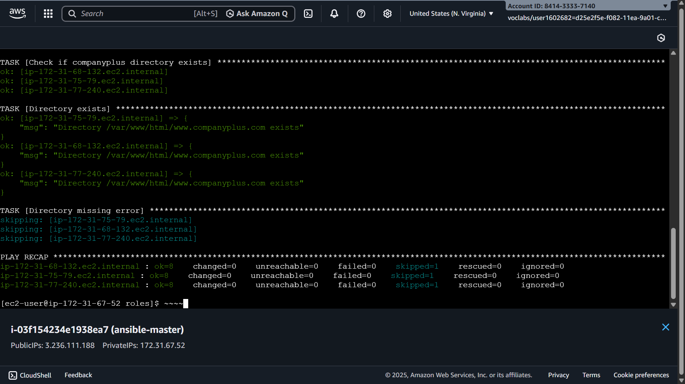

# Provisioning-Web-Servers-With-Ansible
You have a new project at your company that requires 3 new web servers. The requirements are that the web servers must be all consistent, configuration must be controlled and be quick to apply. Each web server must adhere to the given configuration parameters. All VMs will be running in AWS.

# Instructions Summary
The Ansible playbook should do the following:
* Run the playbook against the `aws` host group which contains the 3 EC2 instances
* Ports `80` and `443` open on firewalld
    * If you have re-provisioned or have not used the demos in this course, you’ll need to also include a task to install `firewalld` via the `package` module and then via the `service` module start `firewalld`. If you are using the same EC2 instances you did for exercises and demos, you will not need to install firewalld
    * Use a list group variable named `ports` and loop through each item in the list and open those ports in firewalld
    * Make the rule permanent and apply it immediately via the firewalld module
* Check for the existence of a directory called `/var/www/html/www.companyplus.com` and if it does not exist display an error via the `debug` module and if it does exist, print a message stating it exists via the `debug module in a block section
* Create a role named `webserver` that does the following:
    * Install `nginx` package using the Ansible `package` module
        * Create a role var named `webserver` and set it `nginx` and use that variable in the package module
    * Create a directory named `/var/www/html/www.companyplus.com` and `/var/www/html/www.companypulsar.com` and give the group `nginx` and user `nginx` full permissions (`mode 770`) on the folders using Ansible loops
    * Template the `nginx.conf.j2` file using Jinja using the provided config block in the starter folder. The config block contains the following variables:
        * `app_root`
        * `server_name`
        * `document_root`
    * Create a role handler that restarts the nginx service once the template task is done
* When calling the role in the playbook, use the following values for the role variables:
    * `app_root: html_demo_site-main`
    * `server_name: "{{ ansible_default_ipv4.address }}"`
    * `document_root: /var/www/html`

Run the playbook against the hosts and ensure it succeeds
`ansible-playbook -i inventory.ini`

---

# EC2 VMs and Playbook Outputs Screenshots Images

---
